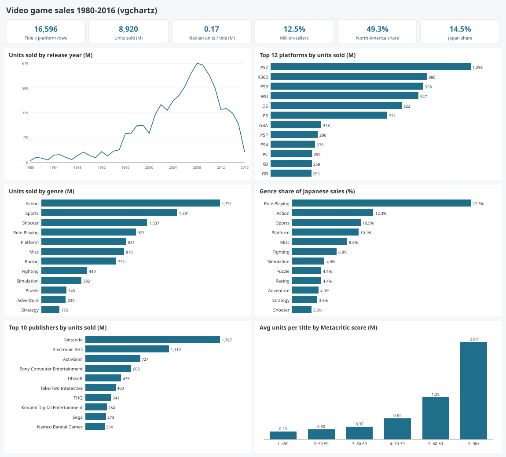
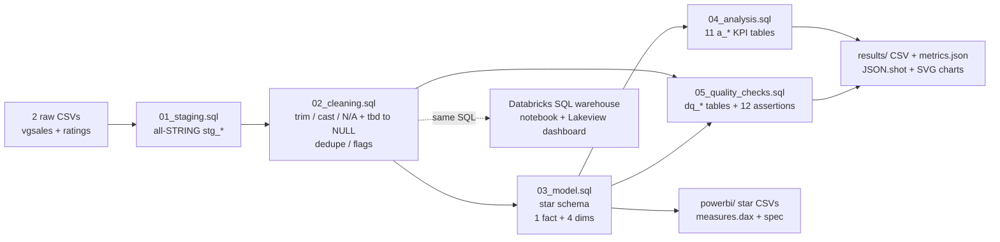

# da-learn-19 - Video game sales analysis (vgchartz 1980-2016 + Metacritic scores)

**Data Analyst learning series, project 19.** An end-to-end analyst workflow on the classic **vgchartz video game sales**
scrape (16,598 title x platform rows, 1980-2016, sales by region) enriched with **critic / user scores and ESRB ratings**
from the "Video Game Sales with Ratings" scrape - SQL data cleaning, a star schema, market KPIs (platform and publisher
share, regional taste, hit concentration, review impact), data-quality evidence, and dashboard packages for
**Databricks** and **Power BI**.

* SQL is written in the **Databricks / Spark SQL dialect** and executed locally on **DuckDB** (a 4-macro shim file covers the differences).
* All results come from the **full datasets**. Git holds a reproducible subset of the raw data (see [Dataset](#dataset)).
* **Databricks:** schema `workspace.da_learn_19`, published Lakeview dashboard **"da-learn-19 Video game sales"**. Power BI: **kit** (a `.pbix` cannot be built on Linux).



## Business questions
1. How did the market grow and shrink by release year, and how did the regional mix (NA / EU / JP / Other) shift?
2. Which platforms and platform makers sold the most software, and how did the console wars play out year by year?
3. Do regions prefer different genres?
4. How concentrated are sales - across titles (hits) and across publishers?
5. Do higher Metacritic scores go with higher sales?
6. How clean are the source files (missing years, unknown publishers, `tbd` scores, duplicates, join coverage)?

## Pipeline


## Key insights (full data)
| # | Insight |
|---|---|
| 1 | **8,920 M units across 16,596 title x platform rows**, but the median title sells only **0.17 M**; just 12.5 % (2,081) reach a million. The top 1 % of titles (166) take **21.1 %** of all units and the top 10 % take 58.9 %. |
| 2 | **PS2 is the best-selling platform** (1,256 M, 14.1 %), ahead of X360 (980 M), PS3 (958 M) and Wii (927 M). Sony (3,580 M) and Nintendo (3,522 M) are almost tied by maker; Nintendo is also the top publisher (1,787 M, 20.0 % share, 48 % of its titles sell 1 M+). |
| 3 | **Regional taste differs sharply:** Role-Playing is **27.3 % of Japanese units** but 7.5 % of North American; Shooters are 13.3 % of NA and 3.0 % of Japan. North America buys 49.3 % of all units. |
| 4 | **Reviews and sales move together:** 90+ Metacritic titles average **2.84 M units** (62 % million-sellers) vs 0.23 M below 50 - a 12x gap (corr 0.39 on log units). The market peaks with 2008 releases (679 M units). |

Full write-up with data-quality findings: [`results/RESULTS.md`](results/RESULTS.md).

## Dataset
| | |
|---|---|
| Sales | vgchartz Video Game Sales - Kaggle `gregorut/videogamesales`; `vgsales.csv` 16,598 rows x 11 columns (Oct-2016 scrape) |
| Ratings | Video Game Sales with Ratings - Kaggle `rush4ratio/video-game-sales-with-ratings`; 16,719 rows x 16 columns (22-Dec-2016; Metacritic critic/user scores, ESRB rating, developer) |
| Licences | Not specified on either Kaggle page (scraped from vgchartz.com / metacritic.com); used here for learning with attribution |
| Full size used | ~2.9 MB of CSV (1.36 MB + 1.60 MB) |
| In git | **Subset** in `data/raw/` (every 200th sales rank = 83 rows + their 83 ratings rows) built by `scripts/make_sample.py`. Details: [`data/README.md`](data/README.md) |

## Cleaning steps (sql/02_cleaning.sql) - full-data row counts
| Step | Raw -> clean |
|---|---|
| Sales: trim, upper-case platform, `TRY_CAST`, `Year = N/A` -> NULL (era "Unknown"), Publisher N/A -> "Unknown" | 271 missing years, 261 unknown publishers |
| Sales: dedupe on lower(title) + platform + year, keep best rank (`ROW_NUMBER()`) | 16,598 -> **16,596** |
| Sales: flags - global vs regional sum mismatch (7), year after snapshot (4), million-seller, mega-hit (>= 10 M) | kept, flagged |
| Ratings: `User_Score = tbd` -> NULL (2,425) and x10 to a 0-100 scale; ESRB `K-A` -> `E`; dedupe on title + platform | 16,719 -> 10,045 rows with any score/rating |
| Model: fact joined to 4 dims + LEFT JOIN ratings on lower(title) + platform | 16,596 fact rows, 0 lost; 8,049 with a critic score |
| Integrity: 12 assertions in `sql/05_quality_checks.sql` | **12/12 PASS** |

## How to run
```bash
pip install -r requirements.txt                 # duckdb
python run_pipeline.py --source sample          # repo sample -> results/sample/ (JSON.shot)
python scripts/download_full_data.py            # full data -> data/raw_full/ (SHA-256 verified)
python run_pipeline.py --source full            # -> results/, data/clean_full/star/, powerbi/data/
python scripts/build_databricks.py              # regenerate notebook + dashboard JSON from sql/ + scripts/project.py
python scripts/make_sample.py                   # rebuild data/raw/ from data/raw_full/
```

## Databricks run (2026-10-02)
| | |
|---|---|
| Warehouse | Serverless Starter Warehouse (Unity Catalog, catalog `workspace`, schema `da_learn_19`) |
| Raw files | `/Volumes/workspace/da_learn_19/raw/` |
| Notebook | `/Workspace/Shared/da-learn-19-video-game-sales/vgsales_pipeline_notebook` |
| Dashboard | **da-learn-19 Video game sales** - published, 8 visuals (2 counters + 6 charts) |
| DuckDB vs Databricks | all 9 stg/cln/dim/fact row counts identical; 12/12 assertions PASS on both; only 1 approximate-median cell differs |

Details: [`databricks/SETUP.md`](databricks/SETUP.md).

## Repo layout
```
data/raw/                    # git sample (83 + 83 rows); raw_full/ and clean_full/ are gitignored
sql/00_duckdb_compat.sql     # DuckDB shims for Spark functions (DuckDB only)
sql/01_staging.sql ... 05_quality_checks.sql
run_pipeline.py              # DuckDB runner: SQL -> tables, metrics.json, JSON.shot, SVG charts
scripts/
  project.py                 # project config (tables, KPIs, visuals) shared by all scripts
  build_databricks.py        # notebook + Lakeview dashboard generator
  svgcharts.py               # dependency-free SVG charts (vector shapes only)
  download_full_data.py, make_sample.py
databricks/                  # notebook + dashboard (exported from the workspace), run_outputs/, SETUP.md
powerbi/                     # data/ (star CSVs, sample-sized), measures.dax, model.md, dashboard_spec.md, BUILD_GUIDE.md
results/
  RESULTS.md  metrics.json  JSON.shot
  charts/*.svg               # dashboard.svg + 6 panels
  tables/*.csv               # KPI + DQ tables (a_publisher_top is regenerated locally, 578 rows)
  sample/JSON.shot
```

## Limitations
* vgchartz numbers are **estimates of physical retail units**, not revenue; digital sales are missing, so recent years are understated.
* 2016 is a partial year (snapshot Oct-2016); 2017/2020 rows are placeholders and are excluded from trend tables.
* Scores come from a second scrape and are matched on exact lower-cased title + platform; 51.5 % of titles have no critic score.
* Correlation between reviews and sales is not causation (marketing budgets, franchises and platform install base confound it).

## Complete dataset
| | |
|---|---|
| Kaggle pages | https://www.kaggle.com/datasets/gregorut/videogamesales and https://www.kaggle.com/datasets/rush4ratio/video-game-sales-with-ratings |
| Mirror URLs | https://raw.githubusercontent.com/amankharwal/Website-data/master/vgsales.csv<br/>https://raw.githubusercontent.com/danieljaouen/DS-Unit-1-Sprint-1-Dealing-With-Data/master/module1-afirstlookatdata/Video_Games_Sales_as_at_22_Dec_2016.csv |
| Licence | Not stated on the Kaggle pages (data scraped from vgchartz.com and metacritic.com by the Kaggle authors); treat as learning / non-commercial use with attribution |
| Total size | ~2.9 MB (vgsales.csv 1,355,781 bytes; Video_Games_Sales_as_at_22_Dec_2016.csv 1,601,320 bytes) |
| File list | `vgsales.csv` (Rank, Name, Platform, Year, Genre, Publisher, NA_Sales, EU_Sales, JP_Sales, Other_Sales, Global_Sales - 16,598 rows); `Video_Games_Sales_as_at_22_Dec_2016.csv` (Name, Platform, Year_of_Release, Genre, Publisher, NA/EU/JP/Other/Global_Sales, Critic_Score, Critic_Count, User_Score, User_Count, Developer, Rating - 16,719 rows) |
| Download | `python scripts/download_full_data.py` -> writes `data/raw_full/` (SHA-256 verified) |
