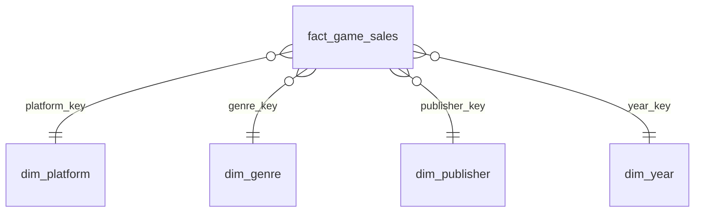

# Power BI model (star schema)

| Table | Grain | Rows (full) | Rows in `powerbi/data/` | Key columns / types |
|---|---|---|---|---|
| `fact_game_sales` | one title on one platform | 16,596 | 150 (top 150 by vgchartz rank) | game_id (int, = vgchartz rank), platform_key, genre_key, publisher_key, year_key (int); na/eu/jp/other/global_sales (decimal, millions of units); critic_score, critic_count, user_count (int); user_score (decimal 0-100); esrb_rating, developer, critic_band, title (text); flags (int 0/1) |
| `dim_platform` | platform | 31 | 31 | platform_key; platform, platform_maker (Nintendo/Sony/Microsoft/Sega/PC/Other), platform_type (Home console/Handheld/PC); first_year, last_year, titles |
| `dim_genre` | genre | 12 | 12 | genre_key; genre |
| `dim_publisher` | publisher | 578 | 17 (publishers of the 150 fact rows) | publisher_key; publisher; titles; publisher_size |
| `dim_year` | release year | 40 | 40 | year_key (0 = unknown year); release_year; era; decade |

Relationships: all many-to-one, single direction (dimension filters fact). Mark nothing as a date table (years only).
Hide all `*_key` columns and `dq_*` flags in report view. Sort `critic_band` and `era` by their own text (prefixes `1:`..`6:` keep order).
Full-size CSVs: `python run_pipeline.py --source full` -> `data/clean_full/star/`.
